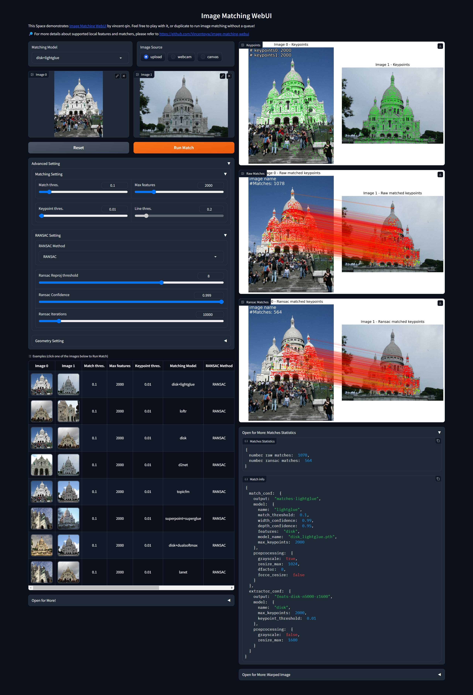

<p align="center">
  <h1 align="center"><br><ins>$\color{red}{\textnormal{Image\ Matching\ WebUI}}$
</ins><br>find matches between 2 images</h1> 
</p>


or deploy it locally following the instructions below.

### Requirements
``` bash
git clone --recursive https://github.com/Vincentqyw/image-matching-webui.git
cd image-matching-webui
conda env create -f environment.yaml
conda activate imw
```
 
### Run demo
``` bash
python3 ./app.py
```
then open http://localhost:7860 in your browser.



### Add your own feature / matcher

I provide an example to add local feature in [hloc/extractors/example.py](hloc/extractors/example.py). Then add feature settings in `confs` in file [hloc/extract_features.py](hloc/extract_features.py). Last step is adding some settings to `matcher_zoo` in file [common/utils.py](common/utils.py).


``` bash
git submodule add https://github.com/cvg/GlueStick.git third_party/GlueStick
```

If remote submodule repositories are updated, don't forget to pull submodules with `git submodule update --remote`, if you only want to update one submodule, use `git submodule update --remote third_party/GlueStick`.


This code is built based on [Hierarchical-Localization](https://github.com/cvg/Hierarchical-Localization). 
